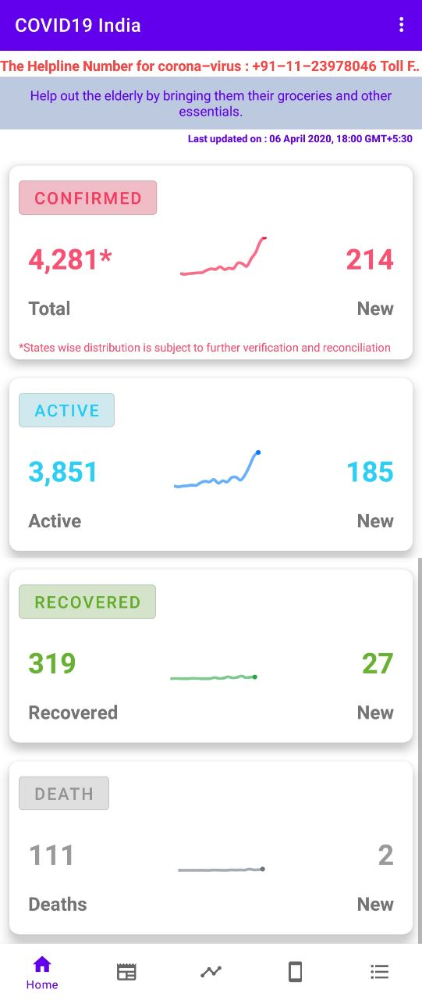
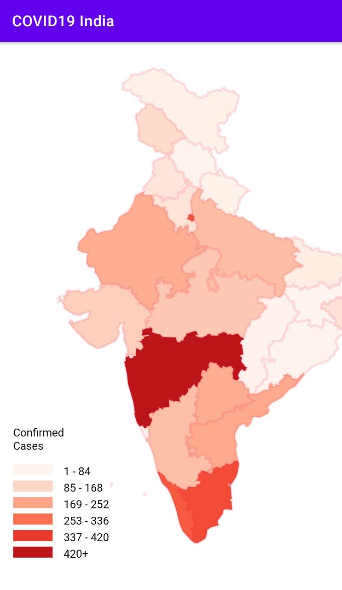
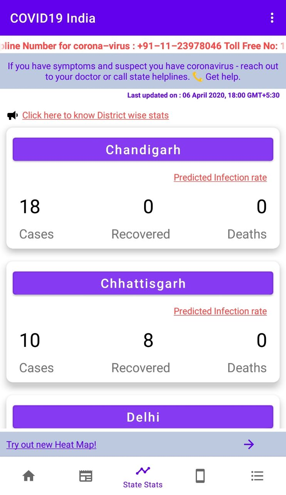
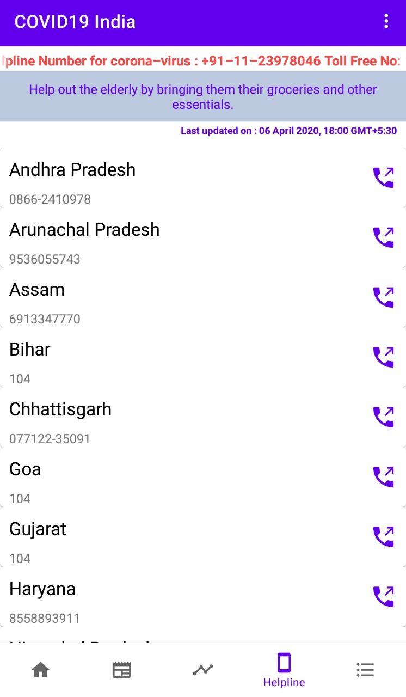

# 📈COVID-19 India Tracker 

💉 Try this [GetVaccinated](https://github.com/pawank0411/GetVaccinated)

:heavy_exclamation_mark: **THIS APP IS NO LONGER MAINTAINED**

A simple Android app to track COVID-19 cases in India.
The data we provide is collected from
[Ministry of Health and Family Welfare(mohfw)](https://www.mohfw.gov.in/)

## 💻 Requirements
* Any Operating System (i.e Linux, Windows)
* Android Studio
* A brain to think 🤓🤓

## ✨ Features
- [x] See all cases statistics.
- [x] Read guides.

## ✨ A Web API To Get Details of Corona in India
  [TheSpeedX](https://github.com/TheSpeedX/covid-india-api)
  
## 📸 Screenshots

## 🤓 Author(s)
**Pawan Kumar Gorai** 

> Feel free to star ⭐ this repository if you like what you see 😉.
